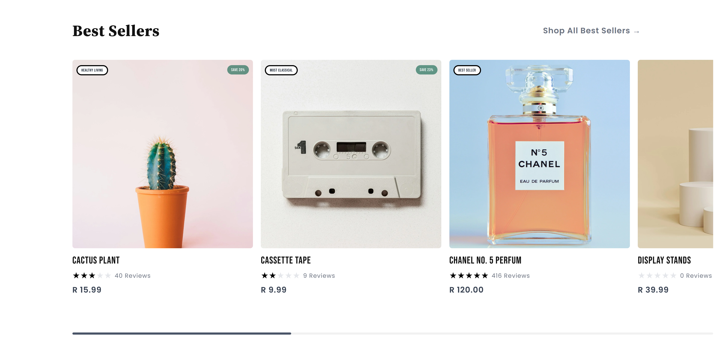
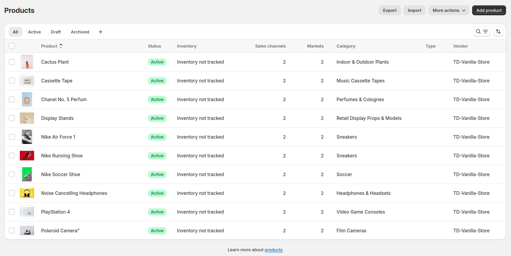

# Shopify Product Section

This project builds upon a previous solution that demonstrated how to develop a reusable, customizable UI component system using plain vanilla JavaScript, HTML, and Tailwind CSS. You can find the previous project [here](https://github.com/Teeldinho/Vanilla-Store). That project aimed to create a customizable, composable design system that could be tweaked for multiple use cases and clientele.

In [this](https://td-vanilla-store.myshopify.com/) Shopify project, we leveraged Shopify's capabilities and metafields to enhance product displays. We started with the Shopify Dawn theme and incorporated Tailwind CSS for styling.

## Introduction

We used metafields for various attributes such as ratings, reviews count, and labels. The label metafield is the most accurate to use, while ratings and reviews count are interdependent and managed carefully.

Our approach involves creating reusable snippets that render specific parts of our components. These snippets can be easily reused across different sections of our Shopify store, promoting consistency and ease of maintenance. This solution serves as a simple introduction to making Shopify Themes using Liquid.

## Metafields

We utilized Shopify metafields to enhance our product displays:

- **Label**: Used to display custom labels like "Best Seller".
- **Rating**: Stores the product rating.
- **Reviews Count**: Stores the number of reviews for the product.

## Components

### Card Component

The "Card" component is the foundation of our product display system. It is composed of several subcomponents that can be reused and rearranged to create different layouts:

- "card-header": Displays the header section of the card.
- "card-content": The main content area of the card.
- "card-title": Displays the title within the card content.
- "card-description": For additional descriptive text.
- "card-footer": For footer content, typically actions or summary.
- "card-image": Displays images within the card.
- "render-stars": Renders the star rating of the product.

### Badge Component

The "Badge" component is used to highlight labels or discounts on products. It supports different variants like "primary" and "secondary" to provide stylistic differentiation. This ensures consistency across the application while allowing contextual customization.

### Product List Component

The "ProductList" component manages the display of product cards. Upon hovering on a product card, we display a secondary image of the product to provide more context.

On Mobile, it shows a limited number of products initially, with an option to reveal more using a "Show More" button. This button triggers a smooth overlay to display additional products on mobile devices, enhancing user experience.

## Tech Used

- **Shopify Dawn Theme**: Customized to serve as the foundation of our project.
- **Tailwind CSS**: Applied for styling, providing a utility-first approach to design.
- **Liquid**: Shopify's templating language, used to create dynamic, data-driven components and templates.
- **JavaScript**: Employed to add interactivity, such as handling the "Show More" button functionality and image hover effects.
- **Shopify Metafields**: Used to store custom data like product ratings, reviews count, and labels.

## Screenshots

#### Shopify Admin: Products

#### Desktop

#### Mobile

## Conclusion

This project demonstrates how to extend [our vanilla JS, HTML and Tailwind solution](https://td-vanilla-store.myshopify.com/) into a shopify environment, and serves as a simple practical introduction to creating Shopify themes using `Liquid`.

By leveraging `metafields` for dynamic data, and reusable `snippets` for reusability, we aimed to build a flexible, maintainable product display system.

We aimed to replicate the concept of compound components in ReactJS, favoring composition over configuration. However, this approach, considering the nature of tools being used and the simplicity of our desired outcome, has its limitations.

The ideas of this approach can be built upon to support a variety of app UIs since it aims to guarantee a consistent user interface and permits modifications and extensions with ease.

> Note: Demo Store Password to be made available upon request.
